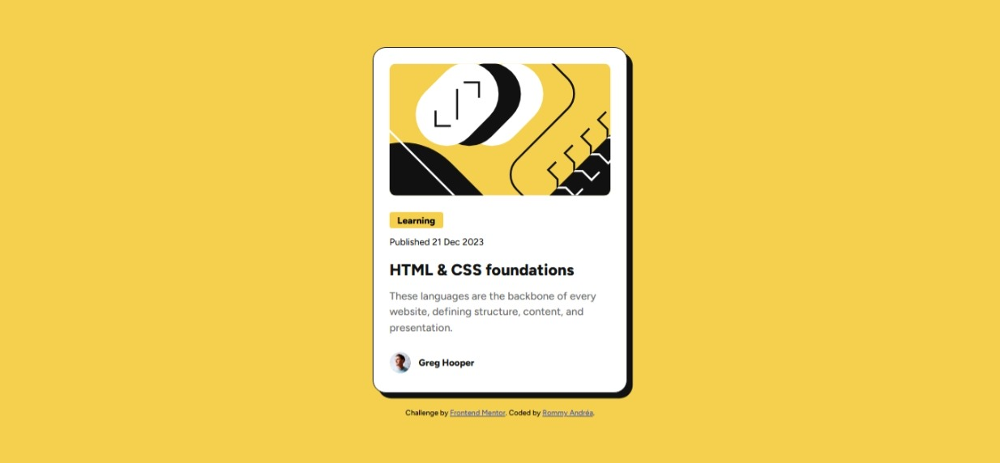

# Frontend Mentor - QR code component solution

This is my solution to the [Blog preview card challenge on Frontend Mentor](https://www.frontendmentor.io/challenges/blog-preview-card-ckPaj01IcS). This challenge helped me practice HTML & CSS fundamentals by building a simple, responsive component.

## 📸 Screenshot

## 🔗 Live site

👉 [Click here to view the live site](https://rommyandrea.github.io/blog-preview-card/)

## 🛠️ Built with

- Semantic HTML5
- CSS custom properties
- Flexbox
- Mobile-first design
- Git & GitHub Pages

## ✍️ What I learned

Through this challenge, I practiced:
- Structuring HTML in a clean and semantic way
- Using Flexbox for layout and alignment
- Organizing CSS with reusable properties
- Deploying a project on GitHub Pages

## 👤 Author

- GitHub – [@RommyAndrea](https://github.com/RommyAndrea)
- Frontend Mentor – [@RommyAndrea](https://www.frontendmentor.io/profile/RommyAndrea)

## 🙏 Acknowledgments

Thanks to [Frontend Mentor](https://www.frontendmentor.io) for the challenge and resources.

